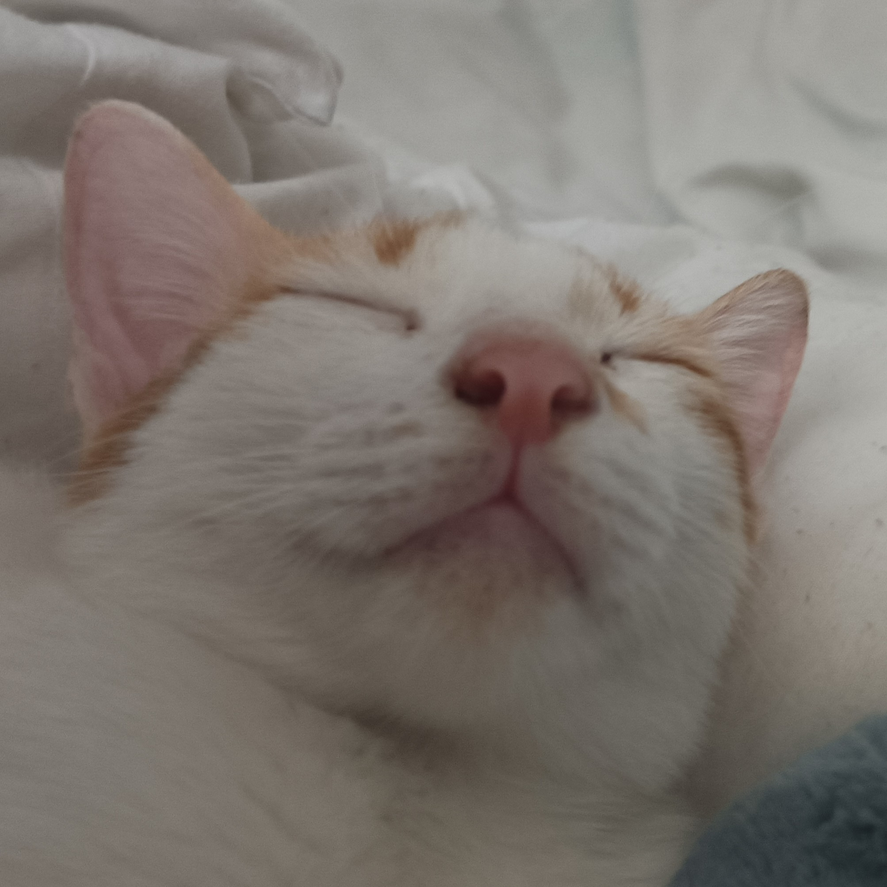

# MINGMAX game engine 

Mingmax is the name of my cat.


## philosophy 

the game dev knows what he is doing and therefore must remain in full-control, and DoD is a chad, oop is gay.

## building

you can build using command: **make \<compiler\>**

```
cd path/to/mingmax
make gcc
```

if you don't have make (peasant!)

```
cd path/to/mingmax
cmake -S . -Bbuild 
cmake --build build
```

## note to reader:

this is a cluttered repo for the benifit of fast development and when i have to transfer to another device 